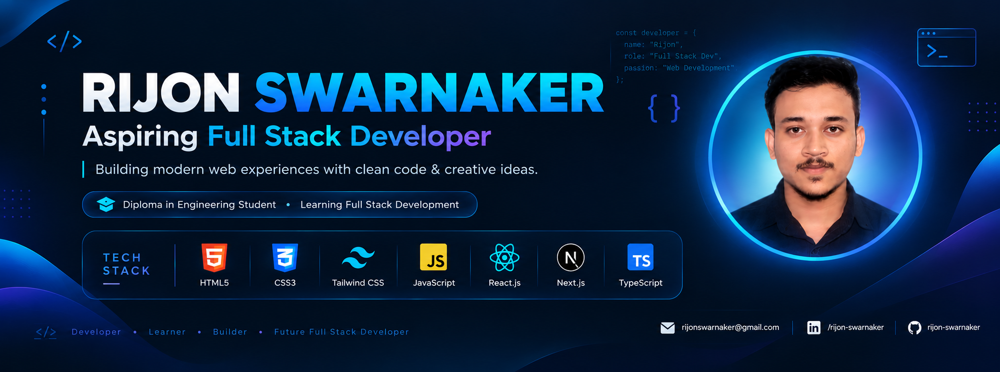

<!-- Banner -->

  

<h1 align="center">Hi 👋, I'm Rijon Chandra Swarnaker</h1>

<h3 align="center">Aspiring Full Stack Developer from Bangladesh</h3>

## 👨‍💻 About Me

* 👋 Hi, I’m [**@rijon-swarnaker**](https://github.com/rijon-swarnaker)
* 🔭 I’m currently working with **React, Next.js & TypeScript** for frontend development.
* 🌱 I’m currently learning **Node.js, Express.js & MongoDB**.
* 💬 Ask me about **Frontend ( JavaScript, React & Next.js )**.
* 🌐 Explore My [**Portfolio**](https://rijon-protfolio.vercel.app/)
* 📫 Reach me via [**Gmail**](mailto:rijonswarnaker@gmail.com)

## 🤝 Connect with Me

  

  

  

# 🛠️ Skills & Technologies

### Languages:

 

  
  

  

### CSS Frameworks & Libraries:

  

  

### JavaScript Frameworks & Libraries:

  

  

### Design & Graphics:

  

  

  

### Tools & Technologies:

  

   <!-- GitHub -->
  

  <!-- VS Code -->
  

  <!-- Windows -->
  

  

